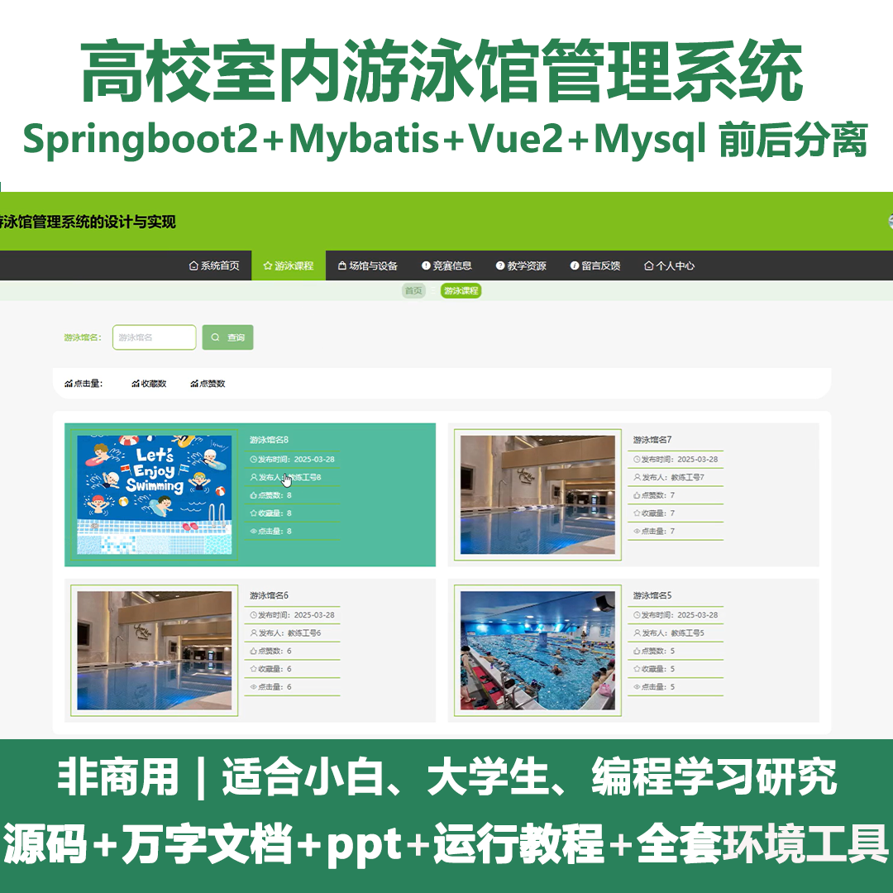
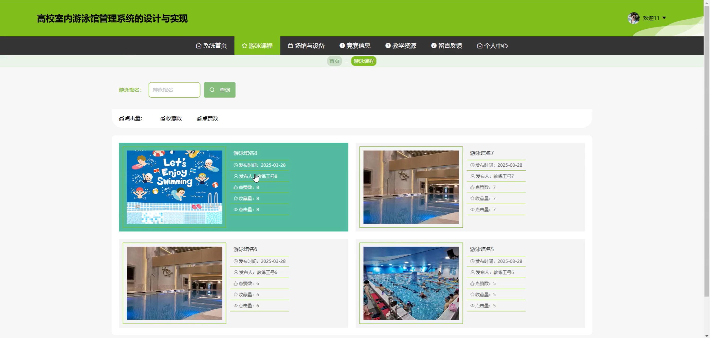
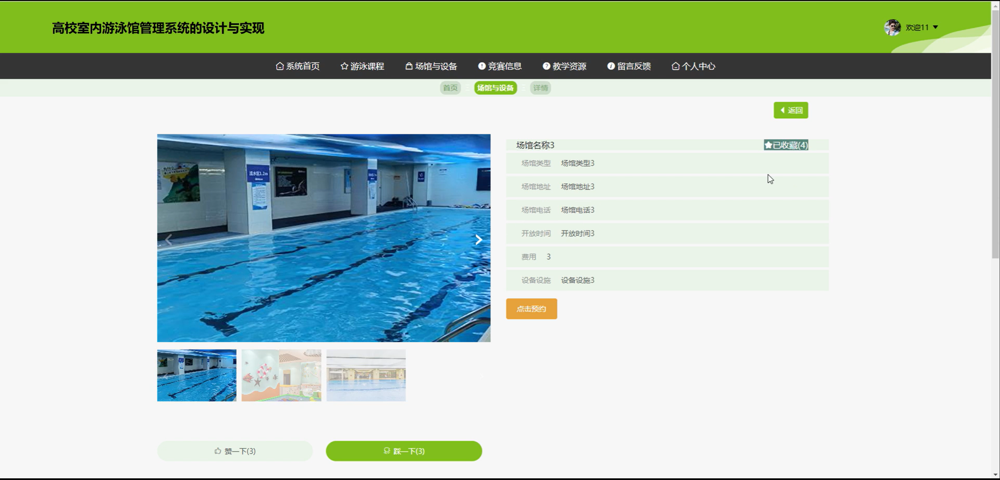
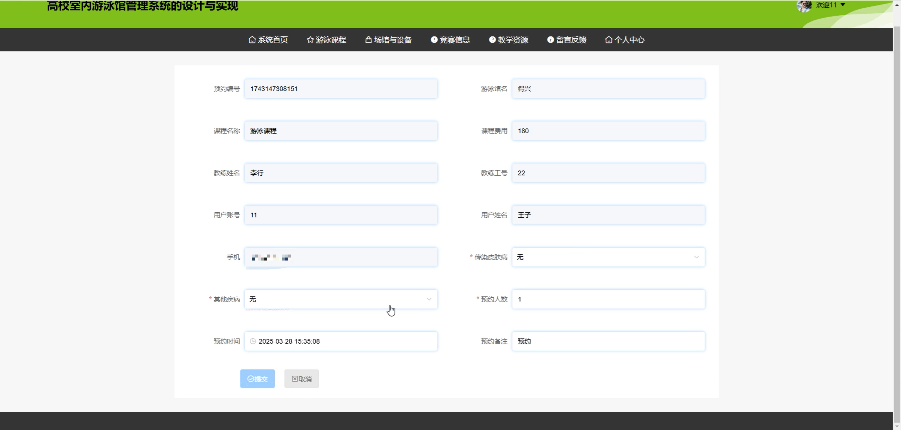
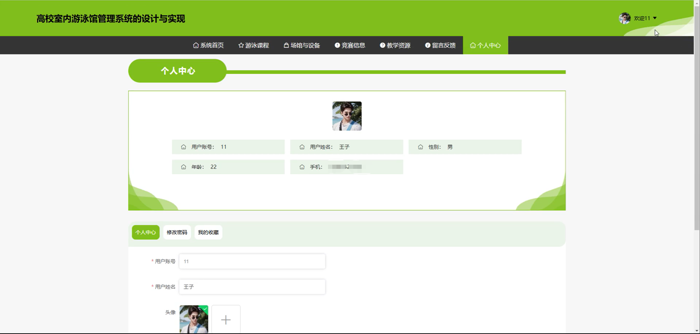
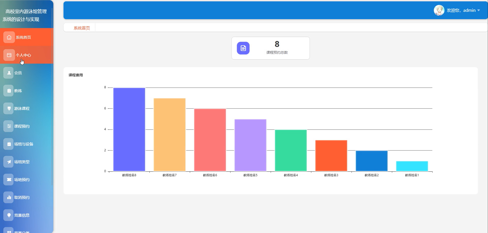
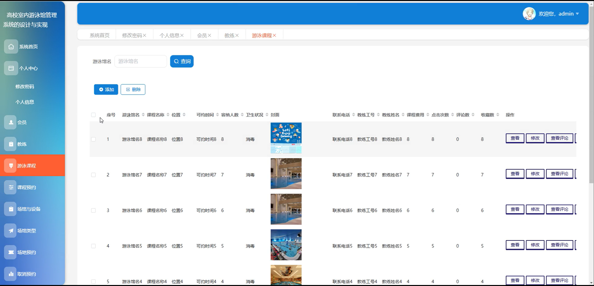
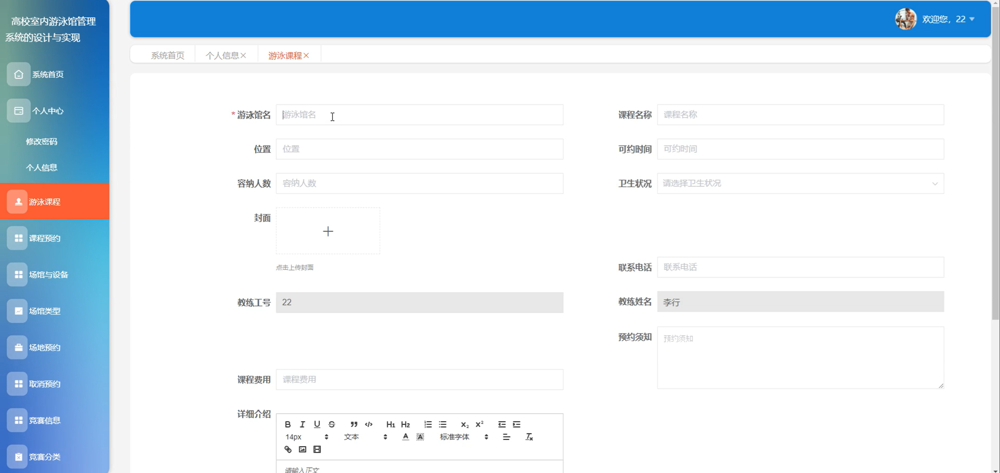
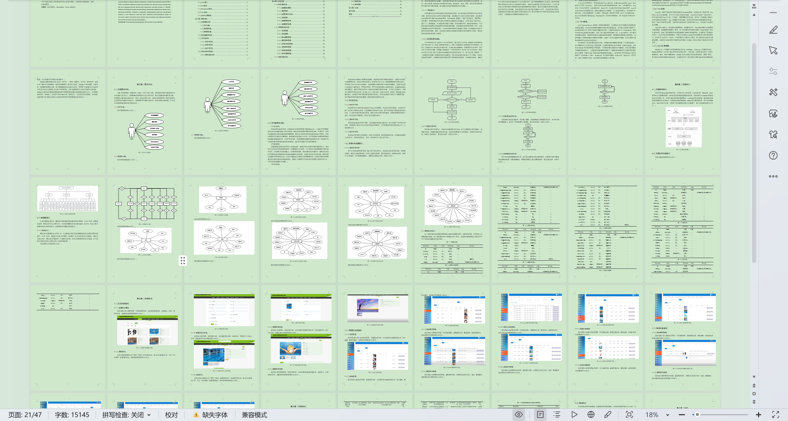

# springbootA425D
springbootA425D高校室内游泳馆管理系统+LW+PPT
 
## 查看主页获取源码

### 一、关键词
游泳竞赛信息、游泳课程、游泳教学资源

### 二、作品包含
源码+数据库+设计文档万字+ppt+全套环境和工具资源+本地部署教程

### 三、项目技术
前端技术：Html、Css、Js、Vue2.0、Element-ui 
后端技术：Java、SpringBoot2.0、MyBatis

### 四、运行环境（以下版本亲测，其他版本未知，请自测）
开发工具：IDEA/eclipse  + VSCODE

数据库：MySQL5.7（最低要5.7版本）

数据库管理工具：Navicat10以上版本

环境配置软件： JDK1.8 + Maven3.6.3

前端Nodejs：14

浏览器：谷歌浏览器

### 五、项目介绍
项目编号：springbootA425D

高校室内游泳馆管理系统可对游泳馆的课程等信息及相关预约、反馈等业务进行一体化管理 ，助力高效运营与服务。

角色：管理员、用户、教练

管理员：系统首页、个人中心、会员、教练、游泳课程、课程预约、场馆与设备、场馆类型、场地预约、取消预约、竞赛信息、竞赛分类、教学资源、留言反馈、轮播图管理。

用户：系统首页、游泳课程、场馆与设备、竞赛信息、教学资源、留言反馈、个人中心、修改密码、我的收藏。

教练：系统首页、个人中心、游泳课程、课程预约、场馆与设备、场馆类型、场地预约、取消预约、竞赛信息、竞赛分类、教学资源。

### 六、运行截图

